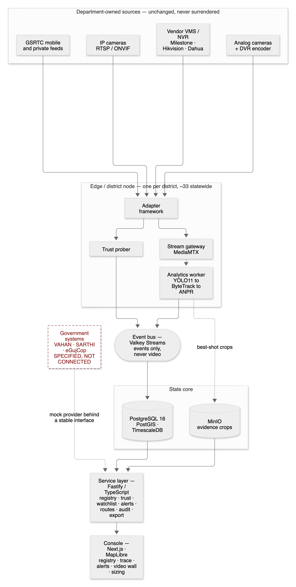

# SAAKSHI — साक्षी, "the witness"

**A camera registry that knows which of its cameras can be trusted, and an analytics layer that
never moves video to prove it.** SAAKSHI federates CCTV estates that were never built to talk to
each other, scores every feed on evidence rather than on what a vendor declared, and turns a plate
into a route across districts. Built for the **Gujarat Police Innovation Challenge 2026**.

| | |
|---|---|
| **Live console** | **https://saakshi.up.railway.app** — credentials are issued to judges separately (see [Access](#access)) |
| **Demo video** (3 min) | https://youtu.be/OrMQH0TKe3Q |
| **Technical proposal / HLD** | [`docs/HLD.md`](docs/HLD.md) · [PDF, 22 pp](submission/saakshi-hld.pdf) |
| **Solution deck** | [`submission/saakshi-solution-deck.pdf`](submission/saakshi-solution-deck.pdf) |
| **Reference model** | **Model 1 (compulsory) + Hybrid**, per [`PROJECT.md` §2](PROJECT.md) |

---

## The problem, in the department's terms

A state police CCTV estate is not one system. It is **26 departments** running **~80,000 cameras**
across incompatible VMS platforms, with a **7–15 day retention window** that quietly deletes the
evidence before anyone knows they needed it.

Three consequences follow, and every one of them is operational rather than theoretical:

1. **Nobody knows what actually works.** A registry row says a camera exists. It does not say the
   camera was dark last Tuesday, that its clock drifts, or that its night frames are unusable for
   a plate. Investigations discover this at the worst possible moment.
2. **Centralising the video is arithmetically impossible.** Streaming 80,000 cameras to one place
   is **160 Gbps** of backhaul that no department will ever fund.
3. **Cross-district questions cannot be asked.** "Where did this vehicle go?" spans silos that have
   no shared identifier, no shared clock and no shared API.

## What SAAKSHI does about it

**Analyse at the edge, move metadata, keep the video where it already lives.** That single decision
takes the backhaul from **160.00 Gbps to 1.28 Gbps — a 125× reduction**
([provenance §6](docs/claims-provenance.md)), and it is what makes every other feature affordable.

- **Registry + GIS** — every camera on a map, with a **trust score** derived from measured decode
  health, clock drift and uptime, not from a vendor's datasheet.
- **Coverage gap analysis** — which roads and junctions are *actually* watched by a camera good
  enough to be relied on. The honest answer for this estate is brutal, and we publish it below.
- **ANPR + trace** — a plate becomes a route, reconstructed over a real 540,711-way road graph,
  with an evidence crop behind every sighting.
- **Impossible-transition detection** — the same plate 9.24 km apart, 30 seconds apart, requires
  **1,109 km/h**. That is a cloned registration, and the system says so.
- **Hash-chained audit** — every query is bound to a stated purpose and recorded in a tamper-evident
  chain, because evidentiary systems get challenged in court.



*Five more diagrams — edge/district node, data flow, deployment topology, trust-score pipeline and
the audit chain — are in [`docs/architecture/`](docs/architecture) with their Mermaid sources.*

---

## What is real, what is specified, what we refused to build

**This table is the most important thing in this README.** A system that overstates itself is worth
less than one that states its limits precisely, so here is the boundary, drawn honestly.

| Capability | Status | Evidence |
|---|---|---|
| Camera registry, bulk import, onboarding API | **Live** | [`docs/registry-api.md`](docs/registry-api.md) |
| GIS map + coverage gap analysis | **Live** | [`docs/gap-analysis-sample.pdf`](docs/gap-analysis-sample.pdf) |
| Trust scoring from measured health | **Live** | [`docs/trust-score.md`](docs/trust-score.md) |
| ANPR (plate detection + OCR) | **Live — and it misses its accuracy target, see below** | [`docs/anpr-accuracy.md`](docs/anpr-accuracy.md) |
| Alerting + watchlist matching | **Live** | [`docs/alerting.md`](docs/alerting.md) |
| Trace / route reconstruction over OSM | **Live** | [`docs/route-reconstruction.md`](docs/route-reconstruction.md) |
| Cloned-plate / impossible-transition detection | **Live** | [`docs/cloning-detection.md`](docs/cloning-detection.md) |
| Evidence store + chain of custody | **Live** | [`docs/chain-of-custody.md`](docs/chain-of-custody.md) |
| RBAC + purpose-bound audit chain | **Live** | [`docs/rbac.md`](docs/rbac.md) |
| Plain-English query box | **Live, optional** — four providers incl. local `ollama` and `none` | [`docs/nl-query.md`](docs/nl-query.md) |
| **VAHAN / SARTHI / eGujCop / AFIS / NAFIS** | **Specified, NOT live.** Connector interfaces are written and served by a **mock provider**. No government system is connected. | [`docs/watchlist-integration.md`](docs/watchlist-integration.md) |
| **Vehicle re-ID** | **Built, ships DISABLED.** Held-out precision **0.761** against our own 0.9 bar — one link in four would be wrong, and a wrong link corrupts an evidentiary route. | [`docs/reid.md`](docs/reid.md) |
| **Face recognition / biometrics** | **Out of scope by choice.** Not mandated, needs separate legal authorisation. **No biometrics are processed or stored.** | [`PROJECT.md` §11](PROJECT.md) |
| **Central video storage** | **Refused by the architecture** — that is the 160 Gbps above. | [`docs/sizing-model.md`](docs/sizing-model.md) |
| **VLM "suspicious activity detection"** | **Refused.** Unfalsifiable, unauditable, and unaffordable at 80,000 cameras. | [`PROJECT.md` §11](PROJECT.md) |

---

## Measured numbers — including the ones we fail

Every figure below is traceable to the ticket that measured it and the command that reproduces it.
The full table is [`docs/claims-provenance.md`](docs/claims-provenance.md); nothing is quoted here
that is not in it.

### Against the challenge's six stated targets

| Target | Measured | Verdict |
|---|---|---|
| 1,00,000+ camera records | **1,00,000** benchmarked | **meets** |
| API response < 200 ms | p95 **110 ms** @ 200 concurrent · **252 ms** @ 500 | **meets to 200, over at 500** |
| Dashboard load < 3 s | readable **132 ms** · map fully drawn **1.65 s** | **meets** |
| **Detection accuracy > 90%** | exact read recall **0%** | **MISSES** |
| **Uptime > 99%** | **100.000%** over a stable 30 min · **73.5%** over a build hour | **not measured over a meaningful period** |
| 500+ concurrent users | **500 concurrent, zero failed responses** | **meets on throughput; p95 over target** |

**Two of six are misses and one is unmeasured.** They are printed here for the same reason they are
on slide 19 of the deck rather than dropped: a number nobody can check is a number a scorer is
entitled to discount.

### ANPR accuracy, stated plainly

Measured on **120 hand-labelled vehicle instances** from this estate, day and night sampled
separately ([`docs/anpr-accuracy.md`](docs/anpr-accuracy.md)):

| | |
|---|---|
| Human-legible plates in the sample | **3 of 120** |
| Plate-detection recall | **100%** (on n=3) |
| Exact read recall / precision | **0% / 0%** |
| Character accuracy | **51.8%** |

**The detector finds plates; the OCR cannot read them on this footage.** The dominant cause is the
source material — 3 legible plates in 120 instances is a statement about the sandbox estate's
resolution and camera angles, not a claim that the pipeline is correct. We report it as a **miss**
against the >90% target and we do not average it away.

### Coverage — the finding that matters most operationally

| | |
|---|---|
| Road network analysed | **540,711 ways · 218,137.5 km** |
| Covered by **any** camera | **21.47 km** — 0.0098% |
| Covered by an **ANPR-viable** camera | **2.77 km** — 0.0013% |
| Covered by a **trusted** camera | **0.00 km** |
| Junctions with zero trusted coverage | **6,750 of 6,750** |

That 100% delta between "a camera is there" and "a camera you can rely on" is the entire argument
for trust scoring, measured on a real graph rather than asserted.

---

## Run it

### Quickstart

Requires **Node ≥ 22**, **npm ≥ 10**, and **Docker with Compose v2**. Nothing else for the core
stack — the Python CV workers are optional and covered [below](#python-cv-workers).

```bash
git clone https://github.com/thopatevijay/saakshi.git && cd saakshi
cp .env.example .env

docker compose up -d              # postgres+postgis+timescale · valkey · minio · mediamtx
npm install
npm run build -w @saakshi/shared  # REQUIRED before anything else — see the note below
npm run db:migrate                # schema + seed users
npm run seed:demo-state           # a populated estate — an empty one looks like a broken app
npm run dev                       # API on :4000, web on :3000
```

> **The `@saakshi/shared` build is not optional and not implicit.** `npm install` links the
> workspace but does not compile it, so on a fresh clone `packages/shared/dist/` does not exist yet
> and the very next command fails with `ERR_MODULE_NOT_FOUND:
> @saakshi/shared/dist/db/index.js`. `npm start` runs this step for you; the manual sequence above
> cannot, so it is listed explicitly.

Verify:

```bash
curl -fsS localhost:4000/health        # {"status":"ok","service":"saakshi-api","version":"0.1.0",...}
curl -fsSI localhost:3000 | head -1    # HTTP/1.1 307 Temporary Redirect  -> /login?next=%2F
```

The **307 is correct**: every console route requires a session, so the root redirects to `/login`,
exactly as the hosted deployment does. `curl -fsSL localhost:3000` follows it and returns 200.

Or do all of it with one command — `npm start` sequences the same steps, waits for each to be
healthy, and prints the local sign-in banner:

```bash
npm start              # services · migrations · seed · API · web
npm run stop           # stops app + containers, PRESERVES volumes
```

> **`npm run stop -- --purge` destroys the MinIO volume**, which holds the evidence crops. They
> cannot be regenerated without gateway traffic. Plain `stop` is the safe one, deliberately.

**`seed:demo-state` prints two local sign-in accounts — an operator and an auditor — with random
passwords, once.** It also retires the old `saakshi-dev` fixture users, so that published password
no longer works. Nothing stores those passwords for you; copy them when they are printed, or re-run
the seeder, which issues fresh ones. These are **local** accounts and are unrelated to the hosted
console's credentials.

### Access

The hosted console at **https://saakshi.up.railway.app** uses **separately issued, non-guessable
credentials that are deliberately not in this repository**. Judges receive them with the submission;
[`docs/judge-walkthrough.md`](docs/judge-walkthrough.md) is the guided tour, and
[`docs/deployment.md`](docs/deployment.md) covers the deployment itself.

### Python CV workers

Only needed to run analytics over live feeds. The repo pins a local interpreter, and this is not
optional — Homebrew's `python3` is PEP 668 externally-managed and OpenCV wheels are not reliably
published for 3.14:

```bash
python3.13 -m venv .venv
./.venv/bin/python -m pip install -r workers/requirements.txt
```

`ffmpeg` and `ffprobe` must both be on `PATH` — the HLS adapter shells out to them.

### Tests

```bash
npm run typecheck && npm run lint && npm run test
```

**`npm run test` takes ~5 minutes** — 68 files, 1,442 tests, run one file at a time because the API
suites share a live Postgres, MinIO and Valkey. That is not a hung run. It needs no
`SENTINEL_*` credentials.

---

## Repo map

```
packages/shared     zod schemas + TS types shared by API and web
packages/api        Fastify, TypeScript strict — the API surface, analytics consumers, jobs
packages/web        Next.js 15 + React 19 + Tailwind — the operator console (BFF-proxied)
workers/            Python CV workers — prober, ANPR, tracking, re-ID
db/migrations/      paired up/down SQL, applied transactionally with checksums
docs/               architecture, measurements and every official document
docs/architecture/  the six HLD diagrams, Mermaid sources + rendered PNGs
scripts/            repo tooling — start/stop, OSM import, basemap build, link checks
submission/         the graded artefacts: HLD, deck, government-feed output report
.github/plan/       every ticket, with its acceptance criteria and validation gate
```

### Where to look first, as a reviewer

| Question | File |
|---|---|
| What was decided, and why | [`PROJECT.md`](PROJECT.md) |
| The full technical proposal | [`docs/HLD.md`](docs/HLD.md) |
| Is a number real? | [`docs/claims-provenance.md`](docs/claims-provenance.md) |
| What does it not do? | [`docs/limitations.md`](docs/limitations.md) |
| How was this built? | [`WORKFLOW.md`](WORKFLOW.md) and [`.github/plan/`](.github/plan) |

---

## Stack

TypeScript strict throughout (Fastify · Next.js 15 · shared zod types) · Python 3.13 CV workers
(OpenCV · YOLO11 · ByteTrack · ONNX plate OCR) · PostgreSQL 16 + PostGIS + TimescaleDB · Valkey
Streams · MinIO · MediaMTX · OSRM · MapLibre with self-hosted PMTiles.

**All open source.** The one proprietary option — the plain-English query box — sits behind a
`QueryCompiler` interface with four providers, two of which (`ollama`, `none`) are local or off. With
either, the system is fully functional and fully open. Nothing proprietary is load-bearing.

## Licence

[MIT](LICENSE) for the code in this repository.

**Model weights are licensed separately and are not committed here** — YOLO11n is **AGPL-3.0**, the
plate detector and OCR models are MIT, the PP-OCR models Apache-2.0. Every model, its source and its
licence: [`docs/model-licences.md`](docs/model-licences.md).

`.env.example` is the committed configuration contract and lists every variable the code reads —
enforced by `node scripts/check-env-sync.js`. **`.env` is never committed.**
