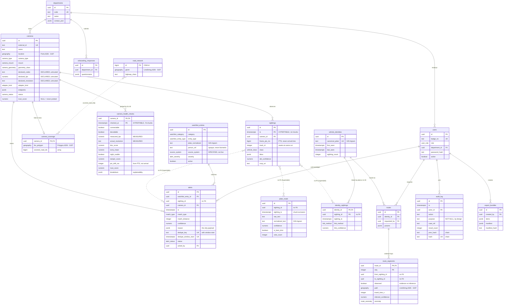

# SAAKSHI data model

Source of truth: `db/migrations/`. Typed mirror: `packages/shared/src/db/schema.ts`. The two are
held together by `packages/api/src/db/schema-drift.test.ts`, which compares the drizzle schema
against `information_schema.columns` and `pg_enum` on every test run.

Measured platform (verified 2026-09-04, not assumed): **PostgreSQL 16.14**, **PostGIS 3.6.4**,
**TimescaleDB 2.29.2**, pg_trgm 1.6, fuzzystrmatch 1.2, pgcrypto.

## ER diagram

## Table-by-table

| Table | Purpose | Notable |
|---|---|---|
| `departments` | The estate is owned by many departments with no shared registry — that premise is Model 1's whole reason to exist. | `code` is the natural key that seeds and imports upsert on. |
| `users` | RBAC subjects. | Four roles, seeded one each, so authorisation is testable from day one. |
| `cameras` | Pillar 1's registry. | **Declared** codec/fps/resolution sit beside nothing that trusts them. `trust_score` is `NULL` until probed — unknown is not zero. |
| `camera_health_checks` | **Hypertable**, 7-day chunks. Every probe result. | The *measured* half of the declared-vs-measured delta. `breakdown` keeps the trust score explainable rather than magic. |
| `camera_coverage` | Field of view per camera, and which roads it covers. | Feeds GIS gap analysis (D3-06). |
| `road_network` | OSM import target. | Table only here; the import is D3-01. |
| `sightings` | **Hypertable**, 1-day chunks. Every tracked object on every camera. | `frame_pts_ms` is PTS. `track_id` resets at a scene cut and must not bleed across it. |
| `plate_reads` | One OCR read per frame; several vote into one answer. | GIN trigram index on `normalized_text` is the single highest-leverage index in the system. A rejected read is kept — the rejection rate per camera is itself a trust signal. |
| `vehicle_identities` | One row per canonical plate. | |
| `identity_sightings` | Which sightings belong to which identity, and *how* they were linked. | `reid_bridge` is a weaker claim than a plate match and the UI must show it differently. |
| `watchlist_entries` | Vehicles and persons of interest. | `source_system` records the connector an entry is *modelled on*. There is no live VAHAN/SARTHI/eGujCop/AFIS/NAFIS connectivity. `person_ref` is an opaque case reference — no biometrics are stored anywhere. |
| `alerts` | Matches worth an operator's attention. | `reason` carries the evidence so an alert is verifiable in three seconds. Dedupe is enforced by a unique index, not by hopeful application code. |
| `routes` / `route_segments` | Reconstructed movement. | `observed` separates what was actually seen from what OSRM inferred. Conflating the two in a police tool is the failure mode this column exists to prevent. |
| `audit_log` | Tamper-evident chain over every access to personal data. | `purpose` is `NOT NULL`. Append-only, enforced twice. |
| `export_bundles` | Court-ready evidence exports. | `manifest_hash` lets a recipient verify what they were given. |
| `onboarding_responses` | The department questionnaire, as submitted. | Model 1 deliverable (D4-06). |

## Three decisions worth knowing

**1 · No foreign keys into `sightings`.** PostgreSQL cannot declare a `REFERENCES` clause against a
Timescale hypertable. So `plate_reads`, `identity_sightings`, `alerts` and `route_segments` carry
`sighting_id` **plus** `sighting_ts`, unenforced by the database. The timestamp is not redundant: it
is what lets the planner exclude chunks — a lookup by id alone scans every daily chunk. Referential
integrity is the writer's responsibility, and both writers are ours.

**2 · Composite primary keys on the hypertables.** Timescale requires the partitioning column in
every unique constraint, so `sightings` is keyed `(id, ts)` and `camera_health_checks` is keyed
`(camera_id, checked_at)`.

**3 · `audit_log` is append-only in two independent layers.** `saakshi_app` — a role deliberately
less privileged than the database owner — holds only `SELECT` and `INSERT`. On top of that, BEFORE
`UPDATE`/`DELETE` triggers raise `restrict_violation`, so even a role that somehow acquired the
grant is refused. Grants can be changed by an administrator in a hurry; a trigger appears in a
schema diff.

## Migrations

Hand-authored paired SQL, applied by `packages/api/src/db/migrate.ts` over a `schema_migrations`
ledger. drizzle-kit generates forward SQL only — it has no down migrations — and the schema needs
`create_hypertable`, GIN opclasses, enum types, partial indexes and triggers that drizzle cannot
express.

| | |
|---|---|
| `npm run db:migrate` | apply pending migrations (idempotent) |
| `npm run db:rollback` | revert the newest applied migration; `-- --all` reverts everything |
| `npm run db:reset` | drop and recreate `public`, then migrate |
| `npm run db:status` | list applied vs pending |

Each migration runs in one transaction, and its checksum is recorded: editing an applied migration
fails loudly rather than leaving two databases with the same version number and different shapes.

| Version | Contents |
|---|---|
| `0001_extensions` | timescaledb, postgis, pg_trgm, fuzzystrmatch, pgcrypto |
| `0002_enums` | all 16 enum types |
| `0003_core` | departments, users, cameras, camera_coverage, road_network |
| `0004_timeseries` | camera_health_checks, sightings + `create_hypertable` |
| `0005_anpr_identity` | plate_reads, vehicle_identities, identity_sightings + trigram indexes |
| `0006_watchlist_alerts` | watchlist_entries, alerts + the dedupe unique index |
| `0007_routes` | routes, route_segments |
| `0008_audit_export` | audit_log + append-only guard, export_bundles, onboarding_responses, `saakshi_app` |
| `0009_seed` | 5 departments, 4 users |

Seed credentials are **development only**: all four users have the password `saakshi-dev`, hashed
with pgcrypto bcrypt. D4-01 must not deploy these rows; D4-02 issues separate judge credentials.
